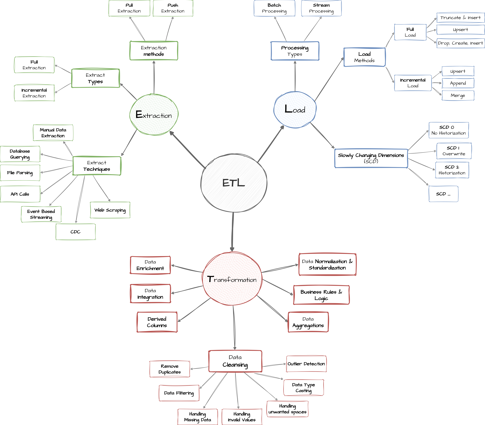
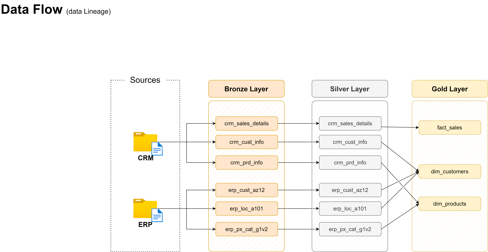

# 🚀 Data Warehouse and Analytics Project

<p align="center">
  <b>End-to-End Modern Data Warehouse using MySQL 8.0</b><br>
  Built with the Medallion Architecture (Bronze • Silver • Gold)
</p>

<p align="center">


</p>

---

## 📖 Overview

This repository demonstrates the design and implementation of a complete **Data Warehouse and Analytics** solution using **MySQL 8.0**.

The project follows the **Medallion Architecture**, implementing an end-to-end ETL pipeline that ingests raw CRM and ERP data, transforms it into clean business-ready datasets, and exposes a Star Schema for analytical reporting.

---

# 🏗️ Data Architecture

<p align="center">

</p>

### Architecture Layers

| Layer | Purpose |
|-------|---------|
| 🥉 Bronze | Raw data ingestion from CSV files using `LOAD DATA INFILE` |
| 🥈 Silver | Data cleansing, standardization, normalization and integration |
| 🥇 Gold | Business-ready analytical model using a Star Schema |

---

# 🔄 ETL Process

<p align="center">

</p>

The ETL pipeline performs:

- Extract data from CRM and ERP CSV files
- Bulk load into Bronze tables
- Clean and standardize data
- Apply business rules
- Integrate multiple source systems
- Publish analytical views

---

# 🌊 Data Flow

<p align="center">

</p>

This diagram illustrates how data flows from source systems through the Bronze, Silver and Gold layers until it becomes analytics-ready.

---

# 🔗 Data Integration

<p align="center">

</p>

Customer and product information from CRM and ERP systems are integrated into unified business entities used by the analytical model.

---

# ⭐ Star Schema (Data Model)

<p align="center">

</p>

The Gold layer consists of:

- **gold_dim_customers**
- **gold_dim_products**
- **gold_fact_sales**

forming a classic Star Schema optimized for reporting and analytical queries.

---

# 📂 Source Systems

### CRM
- Customer Information
- Product Information
- Sales Transactions

### ERP
- Customer Master Data
- Product Categories
- Geographic Information

---

# 🛠️ Technology Stack

| Category | Technology |
|----------|------------|
| Database | MySQL 8.0 |
| IDE | MySQL Workbench |
| Source | CSV Files |
| Loading | LOAD DATA INFILE |
| Documentation | Markdown |
| Diagrams | Draw.io |
| Version Control | Git & GitHub |

---

# ✨ Features

- End-to-End Data Warehouse
- Medallion Architecture
- ETL Pipeline
- Data Cleansing & Standardization
- Multi-source Data Integration
- Star Schema Modeling
- Fact & Dimension Design
- SQL Analytics
- Data Quality Validation
- Professional Documentation

---

# 📁 Repository Structure

```text
sql-data-warehouse-project/
│
├── datasets/
│
├── docs/
│   ├── data_architecture.png
│   ├── ETL.png
│   ├── data_flow.png
│   ├── data_integration.png
│   ├── data_model.png
│   ├── data_catalog.md
│   ├── naming_conventions.md
│   └── data_layers.pdf
│
├── scripts/
│   ├── init_database.sql
│   ├── bronze/
│   ├── silver/
│   ├── gold/
│   └── quality_checks/
│
├── README.md
├── LICENSE
└── .gitignore
```

---

# 🚀 Getting Started

## Prerequisites

- MySQL 8.0
- MySQL Workbench
- Git

## Execution Order

```text
1. init_database.sql
2. create_bronze_tables.sql
3. load_bronze.sql
4. create_silver_tables.sql
5. load_silver.sql
6. create_gold_views.sql
7. quality_checks_silver.sql
8. quality_checks_gold.sql
```

---

# 📊 Skills Demonstrated

- SQL Development
- Data Engineering
- Data Warehousing
- ETL Pipeline Development
- Data Modeling
- Star Schema Design
- Data Integration
- Data Quality
- Analytical SQL

---

# 🔮 Future Enhancements

- Incremental Loading
- Change Data Capture (CDC)
- Slowly Changing Dimensions (SCD Type 2)
- Scheduling & Automation
- Power BI / Tableau Dashboard
- Performance Optimization

---

# 📜 License

Licensed under the **MIT License**.

---

⭐ If you found this project useful, consider giving it a star!
